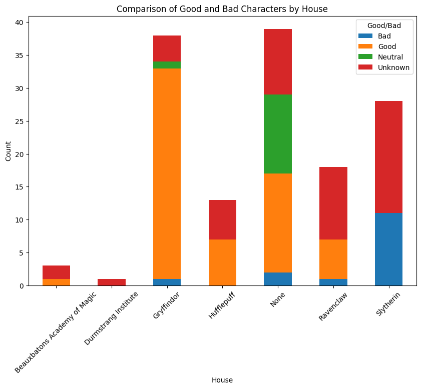
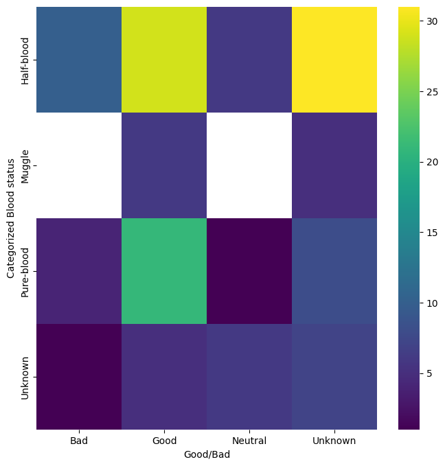
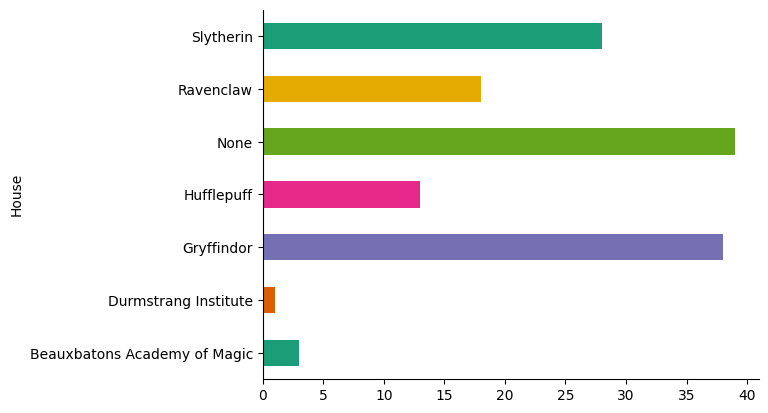
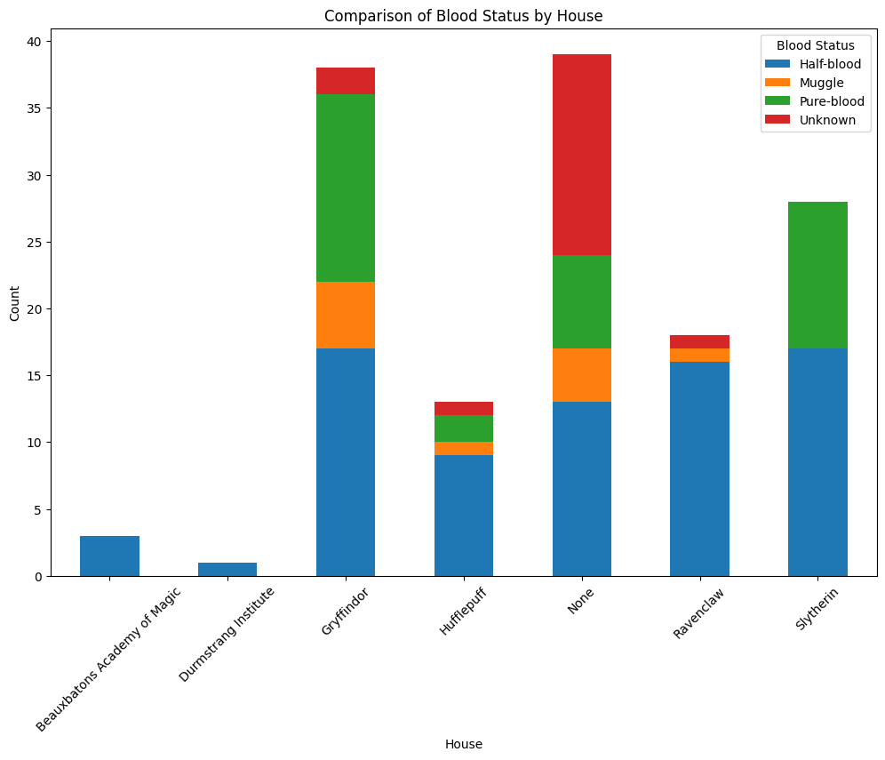

# HPWorld-DataAnalysis

# Harry Potter Data Analysis Project

## Project Overview

This project involves data analysis of a dataset based on characters from the Harry Potter universe. The dataset contains various attributes of the characters, such as their name, gender, house, wand, patronus, species, blood status, and more. This is also accompany by Potter:DB information about the Harry Porter universe using their API. The goal of this analysis is to explore, categorize, and gain insights into the characters, especially focusing on their loyalty and other attributes.

## Dataset

The dataset used in this project contains the following columns:
- `Id`: Unique identifier for each character
- `Name`: Name of the character
- `Gender`: Gender of the character
- `Job`: Job or role of the character
- `House`: Hogwarts house of the character
- `Wand`: Description of the character's wand
- `Patronus`: The character's Patronus
- `Species`: Species of the character
- `Blood status`: Blood status (e.g., pure-blood, half-blood, Muggle-born)
- `Hair colour`: Hair color of the character
- `Eye colour`: Eye color of the character
- `Loyalty`: Loyalty of the character (e.g., to Hogwarts, Death Eaters, Order of the Phoenix)
- `Skills`: Skills or special abilities of the character
- `Birth`: Birthdate or birth year of the character
- `Death`: Death date or death year of the character

## Notebooks

### 1. Data Exploration and Cleaning
- **Description**: This notebook includes initial data exploration and cleaning processes. It checks for missing values, inconsistencies, and outliers. The data is then cleaned and prepared for further analysis.
- **Key Steps**:
  - Loading the dataset
  - Inspecting the data types and structure
  - Handling missing values
  - Correcting inconsistencies

### 2. Data Analysis and Visualization
- **Description**: This notebook focuses on analyzing the dataset to extract meaningful insights. Various visualizations are created to understand the distribution and relationships between different attributes.
- **Key Steps**:
  - Analyzing the distribution of characters across houses
  - Examining the relationship between loyalty and other attributes
  - Visualizing the distribution of wands, Patronuses, and species

### 3. Character Categorization
- **Description**: This notebook categorizes characters based on their loyalty and other attributes. It involves filtering and grouping the data to create specific categories and profiles of characters.
- **Key Steps**:
  - Categorizing characters based on loyalty
  - Creating profiles for different categories
  - Summarizing key characteristics of each category

## Requirements

- Python 3.x
- Jupyter Notebook
- pandas
- numpy
- matplotlib
- seaborn
## Result Data

The result of the analysis is stored in the `result_df.csv` file, which includes the following columns:
- `Id`: Unique identifier for each character
- `Name`: Name of the character
- `Gender`: Gender of the character
- `House`: Hogwarts house of the character
- `Species`: Species of the character
- `Loyalty`: Loyalty of the character, represented as a string of affiliated groups
- `Death`: Death status or date of the character
- `Good/Bad`: Categorization of the character's moral alignment
- `Slug`: URL-friendly slug of the character's name
- `Wiki`: Link to the character's wiki page
- `Categorized`: Indicates if the character has been categorized
- `Blood status`: Blood status of the character
- `Simplified`: Simplified categorization for analysis
- `Nationality`: Nationality of the character

## Tableau link 
Link to visualization

## Dataset

We have included data from the [Harry Potter Dataset](https://www.kaggle.com/datasets/gulsahdemiryurek/harry-potter-dataset?resource=download&select=Characters.csv) dataset on Kaggle for additional analysis and features. Other information are acquired from  [Potter:DB]([https://www.capology.com/](https://potterdb.com/)) API

**Presentation**
[Google Slide](https://docs.google.com/presentation/d/19Ki-JT1panTx1nDKzkvIWd_HcwEqQLb6E1cy636BSvE/edit?usp=sharing)
## Conclusion

This project provides a comprehensive analysis of the characters from the Harry Potter universe. By exploring and categorizing the characters, we gain valuable insights into their attributes and relationships. The analysis can be further extended to explore additional aspects and attributes of the characters.

## License

This project is licensed under the MIT License. See the [LICENSE](LICENSE) file for more details.

## Acknowledgments

- J.K. Rowling for creating the Harry Potter universe
- The contributors of the dataset

